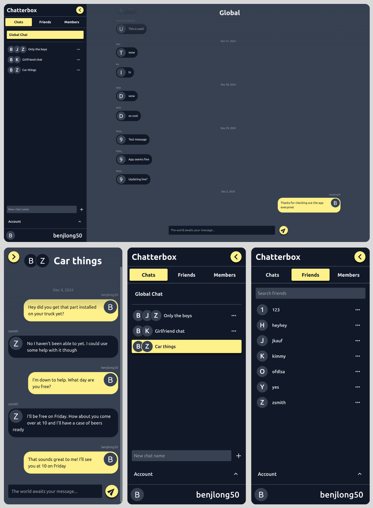

<a id="readme-top"></a>

<!-- PROJECT LOGO -->
<br />
<div align="center">
  <a href="https://github.com/Ben-Long50/chatterbox-frontend.git">
    
  </a>

<h1 align="center">Chatterbox</h1>

  <p align="center">
    A fullstack anonymous messaging app with socket io support
    <br />
    <a href="https://github.com/Ben-Long50/chatterbox-frontend.git"><strong>Explore the docs »</strong></a>
    <br />
    <br />
    <a href="https://chatterbox-messenger.netlify.app/">View Demo</a>
    ·
    <a href="https://github.com/Ben-Long50/chatterbox-frontend/issues/new?labels=bug&template=bug-report---.md">Report Bug</a>
    ·
    <a href="https://github.com/Ben-Long50/chatterbox-frontend/issues/new?labels=enhancement&template=feature-request---.md">Request Feature</a>
  </p>
</div>

<!-- TABLE OF CONTENTS -->
<details>
  <summary>Table of Contents</summary>
  <ol>
    <li>
      <a href="#about-the-project">About The Project</a>
      <ul>
        <li><a href="#built-with">Built With</a></li>
        <li><a href="#features">Features</a></li>
      </ul>
    </li>
    <li>
      <a href="#getting-started">Getting Started</a>
      <ul>
        <li><a href="#prerequisites">Prerequisites</a></li>
        <li><a href="#installation">Installation</a></li>
      </ul>
    </li>
    <li><a href="#contact">Contact</a></li>
  </ol>
</details>

<!-- ABOUT THE PROJECT -->

## About The Project

<a href="https://chatterbox-messenger.netlify.app/">
  
</a>

<p align="right">(<a href="#readme-top">back to top</a>)</p>

### Built With

<a href="https://reactjs.org">
  
</a>

<a href="https://vitejs.dev">
  
</a>

<a href="https://react-query.tanstack.com">
  
</a>

<a href="https://reactrouter.com">
  
</a>

<a href="https://socket.io">
  
</a>

<a href="https://tailwindcss.com">
  
</a>

<p align="right">(<a href="#readme-top">back to top</a>)</p>

<!-- FEATURES -->

### Features

- JWT based local authentication
- Global chat room for use by all members of the application
- Add and remove friends within the app
- Create private chat rooms which can only be used by you and the friends you invite to them
- Monitor activity by checking any members "best friend" list on their profile page
- Real time chat updates using socket io
- Delete sent messages
- Fully responsive design which looks great on any screensize, mobile and desktop
- Light and dark theme support
<p align="right">(<a href="#readme-top">back to top</a>)</p>

<!-- GETTING STARTED -->

## Getting Started

To access the live version of this project and explore all of it's features, use the official website link below. Otherwise, continue with the following instructions to run the project locally

<a href="https://chatterbox-messenger.netlify.app/">
  <strong>Chatterbox »</strong>
</a>

### Prerequisites

1. You will first need to clone the backend API repo and run it. Please take a look at the instructions regarding the backend API in the following link:

   <a href="https://github.com/Ben-Long50/chatterbox-backend.git"><strong>Chatterbox API repo »</strong></a>

### Installation

1. **Clone the Repository**

   Run the following command to clone the repository:

   ```sh
   git clone https://github.com/Ben-Long50/chatterbox-frontend.git
   ```

2. **Navigate to the Project Directory and Install Dependencies**

   Move into the project directory and install the required npm packages:

   ```sh
   cd chatterbox-frontend
   npm install
   ```

3. **Set Up Environment Variables**

   Create a .env file in the project’s base directory and add the following environment variable:

   ```js
   VITE_API_URL = 'http://localhost:3000';
   ```

4. **Avoid Accidental Pushes to the Original Repository**

   If you plan to make changes, update the Git remote to point to your own fork to prevent accidental pushes to the base repository:

   ```sh
   git remote set-url origin https://github.com/<your_github_username>/chatterbox-frontend.git
   ```

   Confirm the change:

   ```sh
   git remote -v
   ```

   You should see:

   ```sh
   origin  https://github.com/<your_github_username>/chatterbox-frontend.git (fetch)
   origin  https://github.com/<your_github_username>/chatterbox-frontend.git (push)
   ```

5. **Start the Development Server**

   Run the following command to start the app:

   ```sh
   npm run dev
   ```

<p align="right">(<a href="#readme-top">back to top</a>)</p>

<!-- CONTACT -->

## Contact

Ben Long - [LinkedIn](https://www.linkedin.com/in/ben-long-4ba566129/)

Email - benjlong50@gmail.com

Project Link - [https://github.com/Ben-Long50/chatterbox-frontend](https://github.com/Ben-Long50/chatterbox-frontend)

<p align="right">(<a href="#readme-top">back to top</a>)</p>

<!-- MARKDOWN LINKS & IMAGES -->
<!-- https://www.markdownguide.org/basic-syntax/#reference-style-links -->
